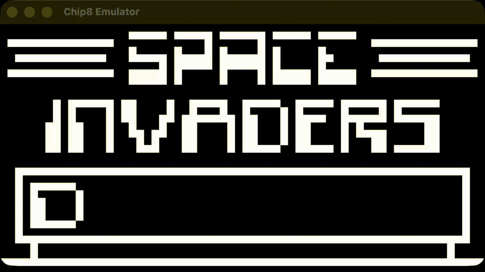

# Chip-8 Emulator (C)

A lightweight Chip-8 emulator written in C using SDL2 for graphics, audio, and input. This project is an educational implementation of the Chip-8 virtual machine and now ships with a cross-platform build powered by CMake and Conan.



## Features

- Emulates the core Chip-8 instruction set
- Uses SDL2 for window rendering, audio playback, and keyboard input
- Configurable key mapping for the 16-key Chip-8 keypad
- Cross-platform toolchain driven by CMake + Conan

## Requirements

- A C compiler (MSVC, Clang, or GCC)
- CMake 3.21 or newer
- Conan 2.x (dependency manager)

Conan will download SDL2 automatically, so no manual SDL installation is required.

## Build Instructions

From the project root:

```bash
# Detect a default Conan profile (only needed once per machine)
conan profile detect --force

# Install dependencies and generate the CMake toolchain files
conan install . --build=missing

# Configure CMake using the Conan-generated toolchain
cmake --preset=conan-release

# Build the emulator (use --config Release on multi-config generators such as Visual Studio)
cmake --build --preset conan-release

# Optionally install to a prefix (defaults to the system location on Unix)
cmake --install ./build/conan-release --prefix ./dist

source build/Release/generators/conanrunenv-release-armv8.sh
```

The compiled executable is placed under `build/Release/bin/chip8-emu` when using multi-config generators (Visual Studio, Xcode) and `build/bin/chip8-emu` for single-config generators (Makefiles, Ninja). After running `cmake --install`, the binaries, headers, and bundled ROMs are copied under the chosen prefix (e.g., `dist/`).

To clean the build tree, simply remove the `build/` directory.

## Usage

Run the emulator with a ROM:

```bash
./build/Release/bin/chip8-emu roms/INVADERS.ch8
```

On Windows (Visual Studio generator) the path will be `build/Release/bin/chip8-emu.exe`. Press <kbd>Esc</kbd> to quit. Key mappings are configurable in `include/config.h`.

## ROMs (Git LFS)

Sample ROMs live under `roms/` and are tracked with [Git LFS](https://git-lfs.com/). Ensure Git LFS is installed and configured before cloning or pulling the repository:

```bash
brew install git-lfs   # macOS example
git lfs install
```

If you already cloned without LFS, pull the ROM binaries with:

```bash
git lfs pull
```

## Project Structure

```
include/        Header files
src/            Source code
build/          CMake build output (generated)
CMakeLists.txt  CMake build script
conanfile.txt   Conan dependency manifest
```

## License

This project is open-source and available under the GPL-3.0 License.
